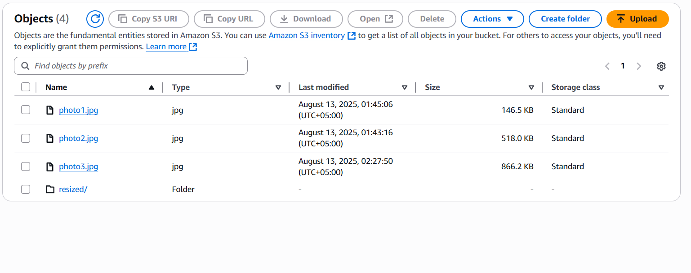
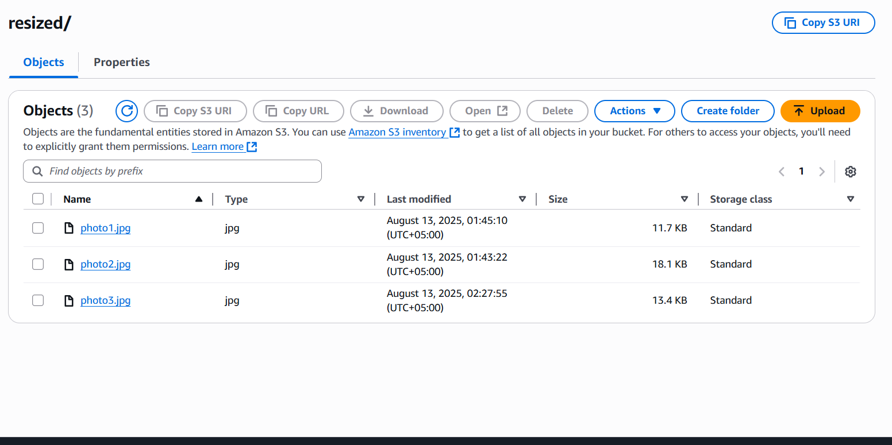
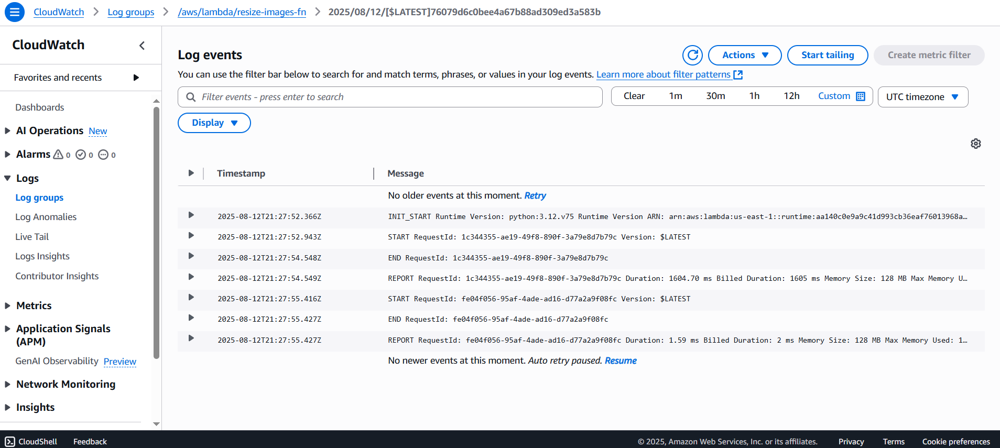
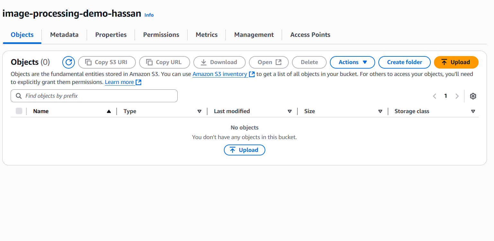
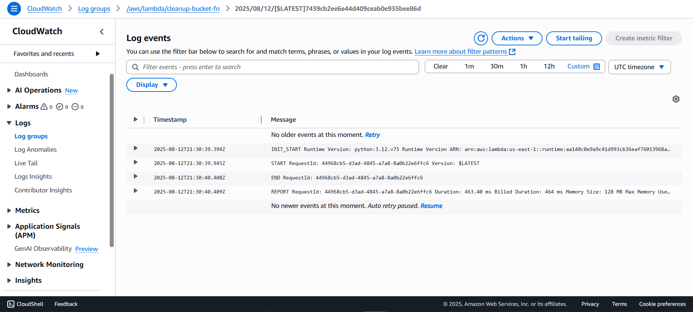
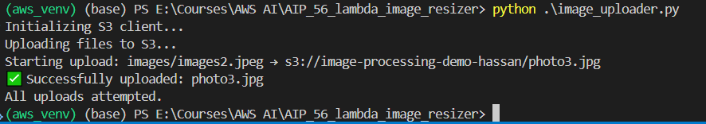

# AWS Lambda Image Resizer with Scheduled Cleanup

This project demonstrates an AWS image processing pipeline using Lambda functions with automated S3 bucket cleanup. It includes image resizing functionality triggered by S3 uploads and a scheduled cleanup job to empty the bucket daily.

## Table of Contents

- [Architecture Overview](#architecture-overview)
- [Project Structure](#project-structure)
- [How It Works](#how-it-works)
- [Setup Instructions](#setup-instructions)
- [Verification Screenshots](#verification-screenshots)
- [Security Notice](#-critical-security-notice)
- [Security Best Practices](#security-best-practices-implemented)
- [Dependencies](#dependencies)
- [Troubleshooting](#troubleshooting)

## Architecture Overview

The solution consists of two main Lambda functions:
1. **Image Resize Function** - Automatically resizes images uploaded to S3
2. **Cleanup Function** - Scheduled to empty the S3 bucket daily using EventBridge (CloudWatch Events)

```
┌─────────────────┐    ┌──────────────────┐    ┌─────────────────┐
│   User Upload   │───▶│   S3 Trigger     │───▶│ Resize Lambda   │
│    Image to S3  │    │                  │    │   Function      │
└─────────────────┘    └──────────────────┘    └─────────────────┘
                                                        │
                                                        ▼
                                               ┌─────────────────┐
                                               │ Resized Image   │
                                               │ Stored in S3    │
                                               │ /resized/ folder│
                                               └─────────────────┘

┌─────────────────┐    ┌──────────────────┐    ┌─────────────────┐
│ EventBridge     │───▶│   Daily Cron     │───▶│ Cleanup Lambda  │
│ (CloudWatch)    │    │   21:30 UTC      │    │   Function      │
└─────────────────┘    └──────────────────┘    └─────────────────┘
                                                        │
                                                        ▼
                                               ┌─────────────────┐
                                               │ Empty S3 Bucket │
                                               │ (All objects    │
                                               │  deleted)       │
                                               └─────────────────┘
```

## Project Structure

```
AIP_56_lambda_image_resizer/
├── resize_lambda.py           # Main image resizing Lambda function
├── delete_bucket.py           # Bucket cleanup Lambda function  
├── roles_and_triggers.py      # Setup IAM roles and S3 triggers for resize function
├── lambda_cleanup_setup.py    # Setup cleanup function with EventBridge schedule
├── image_uploader.py          # Utility to upload test images
├── resize_lambda.zip          # Packaged resize function with dependencies
├── cleanup_function.zip       # Packaged cleanup function
├── preupload.png             # Test image
├── images/                   # Sample images for testing
    ├── ferrari-188954_1920.jpg
    ├── images1.jpg
    └── images2.jpeg

```

##  How It Works

### 1. Image Resize Function (`resize_lambda.py`)

**Key Features:**
- Triggered automatically when images are uploaded to S3
- Resizes images to 300x300 pixels using PIL
- Stores resized images in a `resized/` prefix to avoid processing loops
- Uses temporary files for processing to minimize memory usage

### 2. Cleanup Function (`delete_bucket.py`)

**Key Features:**
- Scheduled to run daily at 21:30 UTC (2:30 AM local time)
- Empties the entire S3 bucket to prevent storage costs
- Uses batch delete operations for efficiency
- Comprehensive error handling and logging

### 3. IAM Roles and Permissions

The project implements **least privilege principle** with two separate roles:

#### Resize Function Role (`roles_and_triggers.py`)
```python
policy_doc = {
    "Version": "2012-10-17",
    "Statement": [
        {
            "Effect": "Allow",
            "Action": ["s3:GetObject", "s3:PutObject"],
            "Resource": [f"arn:aws:s3:::{BUCKET_NAME}/*"]
        },
        {
            "Effect": "Allow", 
            "Action": [
                "logs:CreateLogGroup", 
                "logs:CreateLogStream", 
                "logs:PutLogEvents"
            ],
            "Resource": "arn:aws:logs:*:*:*"
        }
    ]
}
```

#### Cleanup Function Role (`lambda_cleanup_setup.py`)
```python
policy_doc = {
    "Version": "2012-10-17",
    "Statement": [
        {
            "Effect": "Allow",
            "Action": ["s3:ListBucket"],
            "Resource": [f"arn:aws:s3:::{BUCKET_NAME}"]
        },
        {
            "Effect": "Allow",
            "Action": ["s3:DeleteObject"],
            "Resource": [f"arn:aws:s3:::{BUCKET_NAME}/*"]
        },
        {
            "Effect": "Allow",
            "Action": [
                "logs:CreateLogGroup",
                "logs:CreateLogStream", 
                "logs:PutLogEvents"
            ],
            "Resource": "arn:aws:logs:*:*:*"
        }
    ]
}
```

##  Setup Instructions

### Prerequisites
- AWS CLI configured or credentials file available
- Python 3.9+ installed
- Required Python packages: `boto3`, `Pillow`

### 1. Configure AWS Credentials
Ensure your AWS credentials are configured via the CSV file or AWS CLI:
```bash
aws configure
```

### 2. Deploy Image Resize Function

#### Handling Pillow Dependency Issues

During development, we encountered compatibility issues when packaging the Lambda function with Pillow (PIL) library. The issue occurred because:

- **Problem**: Pillow was packaged on a Windows development environment
- **Lambda Runtime**: Functions run on Amazon Linux 2
- **Result**: Binary incompatibility causing import errors

#### Solution: Using Pre-built Lambda Layers

Instead of packaging Pillow directly, we used pre-built AWS Lambda Layers containing the correct Linux-compatible version of Pillow.

**Resources Used:**
- **Troubleshooting Guide**: [AWS Lambda Python PIL Cannot Import Name Imaging](https://derekurizar.medium.com/aws-lambda-python-pil-cannot-import-name-imaging-11b2377d31c4)
- **Layer ARNs Repository**: [Klayers - Python Packages for AWS Lambda Layers](https://github.com/keithrozario/Klayers?tab=readme-ov-file#list-of-arns)

After these were followed for the function then the following files were run:

```bash
python roles_and_triggers.py
```
This script:
- Creates IAM role `lambda-resize-role` with S3 read/write permissions
- Sets up S3 bucket notifications to trigger the function

### 3. Deploy Cleanup Function  
```bash
python lambda_cleanup_setup.py
```
This script:
- Creates IAM role `lambda-cleanup-role` with S3 list/delete permissions
- Deploys the cleanup Lambda function
- Creates EventBridge rule for daily execution at 21:30 UTC
- Links the rule to invoke the Lambda function

### 4. Test the System
```bash
python image_uploader.py
```
Upload test images and verify:
- Images are automatically resized and stored in `resized/` folder
- Check CloudWatch logs for function execution details

### 5. Monitor the System
- Check AWS CloudWatch Logs for both Lambda functions
- Verify S3 bucket contents before and after uploads
- Monitor EventBridge rules in AWS Console

## Verification Screenshots

The project includes several screenshots documenting the working system:

### Pre Image Upload

*Before images uploaded to S3 bucket*

### Original Image Upload

*Original images successfully uploaded to S3 bucket*

### Resized Images Storage

*Resized images automatically stored in `resized/` folder*

### Lambda Execution Logs

*CloudWatch logs showing Lambda execution after image upload*

### After Cleanup Job

*Empty S3 bucket after scheduled cleanup job execution*

### Cleanup Function Logs

*CloudWatch logs from cleanup function showing successful deletion*

### Terminal Upload Process

*Terminal output showing successful image upload process*

## Critical Security Notice

**IMPORTANT: The cleanup cron job MUST be disabled within 24 hours of testing to prevent:**
- Unintended data loss
- Accidental deletion of important files  
- Unexpected AWS charges
- Production environment contamination

### To Disable the Cleanup Job Immediately After Testing:

#### Option 1: Using AWS CLI
```bash
# Remove EventBridge target
aws events remove-targets --rule cleanup-bucket-daily --ids 1

# Delete EventBridge rule
aws events delete-rule --name cleanup-bucket-daily

# Delete Lambda function
aws lambda delete-function --function-name cleanup-bucket-fn

# Delete IAM role policy and role
aws iam delete-role-policy --role-name lambda-cleanup-role --policy-name cleanup-policy
aws iam delete-role --role-name lambda-cleanup-role
```

#### Option 2: Using AWS Management Console
1. Go to **EventBridge Console** → Rules → Delete `cleanup-bucket-daily`
2. Go to **Lambda Console** → Functions → Delete `cleanup-bucket-fn`  
3. Go to **IAM Console** → Roles → Delete `lambda-cleanup-role`

#### Option 3: Using Python Script
Create a cleanup script:
```python
# filepath: cleanup_resources.py
import boto3

def cleanup_scheduled_resources():
    # Delete EventBridge rule
    events_client = boto3.client('events')
    try:
        events_client.remove_targets(Rule='cleanup-bucket-daily', Ids=['1'])
        events_client.delete_rule(Name='cleanup-bucket-daily')
        print("✅ EventBridge rule deleted")
    except Exception as e:
        print(f"EventBridge cleanup error: {e}")
    
    # Delete Lambda function
    lambda_client = boto3.client('lambda')
    try:
        lambda_client.delete_function(FunctionName='cleanup-bucket-fn')
        print("✅ Lambda function deleted")
    except Exception as e:
        print(f"Lambda cleanup error: {e}")
    
    # Delete IAM role
    iam_client = boto3.client('iam')
    try:
        iam_client.delete_role_policy(RoleName='lambda-cleanup-role', PolicyName='cleanup-policy')
        iam_client.delete_role(RoleName='lambda-cleanup-role')
        print("✅ IAM role deleted")
    except Exception as e:
        print(f"IAM cleanup error: {e}")

if __name__ == "__main__":
    cleanup_scheduled_resources()
```

This project successfully demonstrates serverless image processing with automated cleanup while maintaining security best